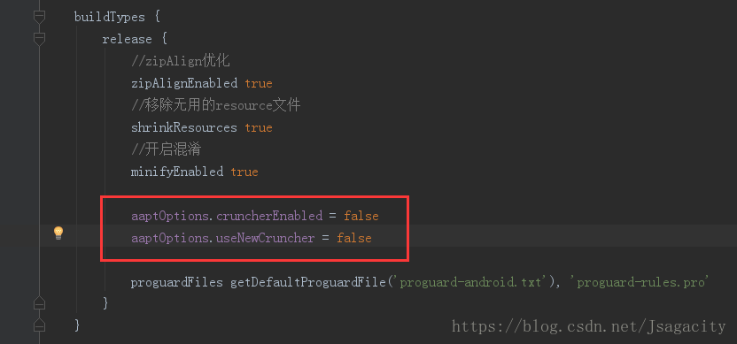

## 问题 1
项目打包遇com.android.builder.internal.aapt.v2.Aapt2Exception: AAPT2 error: check logs for details

Android Studio升级到3.1之后会遇到这样的相关错误：

> java.util.concurrent.ExecutionException: com.android.builder.internal.aapt.v2.Aapt2Exception: AAPT2 error: check logs for details

查了网上很多处理都是在项目的gradle.properties中添加下面的配置，再编译就通过了：

> android.enableAapt2=false

但是但是在打包的时候又出现这样的问题了，在app的build.gradle中添加以下配置：

> aaptOptions.cruncherEnabled = false 

> aaptOptions.useNewCruncher = false

添加到如下的位置，编译之后，打包时是成功的。 

